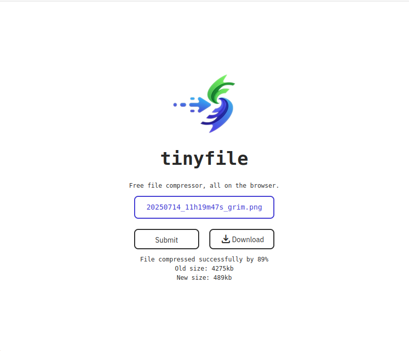

# tinyfile

Tiny file is a tiny file compressor service leveraging web technologies to compress files without the files ever leaving
your browser.



# Demo

https://tiny-file.vercel.app/

# How to use

```shell
$ npm install
$ npm run dev
```

# How to build

```shell
$ npm run build
```

# To do

- [ ] Replace CompressorJS with a more efficient library (e.g. LZMA or a WASM Library)
- [ ] Add a progress bar
- [ ] Add compression settings

# File Support

- [x] Images
- [ ] Audio
- [ ] Video
- [ ] PDF
- [ ] Text
- [ ] Archives
- [ ] Other

# Credits

- [CompressorJS](https://www.npmjs.com/package/compressorjs)
- [Vite](https://vite.dev/)